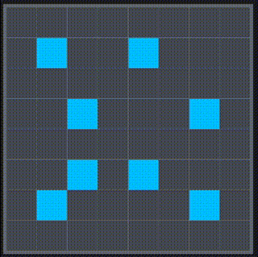

+++
date = '2026-02-01T20:24:00+08:00'
draft = false
title = '熄燈遊戲'
+++
最近玩 Marcus 的[熄燈遊戲](https://immarcus.com/misc/fidgets/lightsout)愛不釋手，所以研究了一下寫一個攻略跟大家分享！

 

---

## 概述

這邊是遊戲頁面列出的規則：

> - 遊戲目標：把整個棋盤變成一個顏色
> - 點選任意一個方塊可以翻轉該方塊所在的行和列

總共有四個不同難度的關卡：

| 難度 | 棋盤大小 | 限時 | 最小點擊次數（出題時點擊的次數） |
| --- | --- | --- | --- |
| 入門／Beginner | 8 ⨯ 8 | 無 |10 |
| 休閒／Easy | 10 ⨯ 10 | 無 |25 |
| 挑戰／Challenging | 12 ⨯ 12 | 五分鐘 |50 |
| 極限／Extreme | 15 ⨯ 15 | 五分鐘 | 100 |

另外還提供了一個自由（free）模式 8 ⨯ 8 的棋盤可以先探索規律。

接下來我會提出一個易於觀察的現象，並運用這個現象，推導如何用簡單的兩步驟破解這個遊戲。

---

## 策略

如果點進去隨便一種關卡看看，可以發現即使是初學的關卡看起來也是十分複雜，所以我們先簡化需要判斷的元素⸺**每行每列熄燈亮燈數量的奇偶**！

接下來為了方便說明，之後會以 `1` 代表此行（或列）有奇數個熄燈（或亮燈）， `0` 代表有偶數個。

首先在自由模式，每點一下之後紀錄每行每列的奇偶（想觀察奇數棋盤的狀態可以省略一行一列），可以發現以下定律：

1. <b>每行每列熄燈亮燈的奇偶關聯</b>：
    - 偶數邊長的棋盤，每行每列熄燈和亮燈各自的奇偶性質是一致的
    - 奇數邊長的棋盤會相反。
2. <b>不同點擊次數下，整體奇偶性的關聯</b>：
    - 在偶數邊長的棋盤，如果點擊偶數次，會有偶數個行（或列）奇偶性為 `0`，偶數個為 `1`；如果點擊奇數次，則會有奇數個 `0` 和奇數個 `1`
    - 在奇數邊長的棋盤，點擊偶數次會讓整體的奇偶性變為 `0`，點擊奇數次會變為 `1`。
3.  <b>在點擊時所改變的奇偶狀態</b>：
    -  在偶數棋盤時，點擊的方格所在的行列奇偶狀態不會改變，其餘行列則會改變
    -  在奇數棋盤時，全部行列的奇偶性都會改變。

這樣子要如何破關就很明顯了！如果以「讓所有燈熄滅」為目標，要破關只需要簡單兩步驟：

1. 讓整體奇偶性與目標一致（偶數棋盤熄燈的奇偶性為全 `0`，奇數棋盤為全 `1`）
2. 在不影響整體奇偶的情況下，讓所有亮著的燈熄滅

---

## 步驟

接下來將以「讓所有燈熄滅」為目標來詳細解說步驟。僅觀察熄燈數的奇偶性。

### 一、使整體奇偶性與目標一致

<i>哦哦哦是[許久不見](/blog/flowfree/)的第三級標題！</i>

奇數棋盤的部分比較簡單，如果發現與目標不一致（奇偶性為全 `0`），隨意點擊棋盤上的一個方格就可以了。

偶數棋盤的話，如果點擊同行／列的兩方格，就會轉變那兩列／行的奇偶。

如果是點擊兩個不同行不同列的方格，就可以直接轉換兩行和兩列的奇偶。這樣做是可以省點擊次數，不過需要記憶比較多行列的狀態，實作起來有時反而比較慢。

聰明的你可能發現了，這樣做一次只能兩兩成對消除，那如果有奇數個行或列需要消除怎麼辦？從上段觀察出的定律 2 可以知道，這是總點擊數是奇數才會發生的情況，因此只要先隨意點擊一處，使總點擊數變成偶數，再進行成對消除就可以啦！

### 二、在不影響整體奇偶性的情況下讓所有燈熄滅
最簡單的方式就是按下一個矩形的四個角，一次轉換四個方格。

有時候也會看到如下，好像沒有矩形可以用的情況，其實只是兩個矩形重疊了，重疊的那一個角負負得正了！重疊反白的部分可以直接不按，不然按兩次其實跟不按的效果其實是一樣的。

有時候重疊的地方多了就可以一次消除許多方格，看了就舒服。

---

## 結論
在這邊列出如何根據上述討論，通過所有難度關卡的步驟（以「讓所有燈熄滅」為前提）：

- 入門：直接執行步驟一、二
- 休閒：先隨意點擊一處（使總點擊數變成偶數），再執行步驟一、二
- 挑戰：直接執行步驟一、二
- 極限：直接執行步驟二。如果發現一行有奇數個燈亮著，則先隨意點擊一處再執行步驟二

另外在下面附上我遊玩的影片，並搭配開局時整體的奇偶性給大家參考！

### 入門／Beginner
橫排（由左到右）／直排（由上到下）：`11001010/10100011`

<video controls>
    <source src="8.webm" type="video/webm">
    there should be a webm file here.
</video>

### 休閒／Easy

初始：`0110010110/1010111101`

校正（隨意點一處）後：`1001001001/0100000010`

<video controls>
    <source src="10.webm" type="video/webm">
    there should be a webm file here.
</video>

### 挑戰／Challenging 

`101110000000/110011101000`

<video controls>
    <source src="12.webm" type="video/webm">
    there should be a webm file here. 
</video>

### 極限／Extreme
全 `1`

<video controls>
    <source src="15.webm" type="video/webm">
    there should be a webm file here.
</video>

---

至於「如何以最小點擊次數破解遊戲」，我還沒有找到一個定律（我只有在入門難度無意間成功過一次），*之後有空再為大家講解*，有興趣的讀者可以先自行研究。

其實這種小品益智遊戲我還挺喜歡的，在學習或尋找規則時感覺很有趣，唯一的缺點是在了解規則之後會變得很簡單，不小心就會玩太久浪費太多時間。

說到浪費時間這篇文章也浪費了我很多時間，去你的熄燈遊戲，有時候寫到一半想說「再熟悉一下好了～」然後就打開遊戲又浪費了更多的時間。不過也不是我的時間不值得這麼浪費啦，或著說我不這樣浪費時間，可能也只是用其它更糟糕的方式浪費時間罷了。
